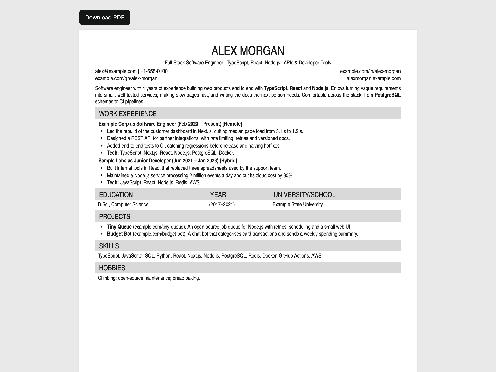
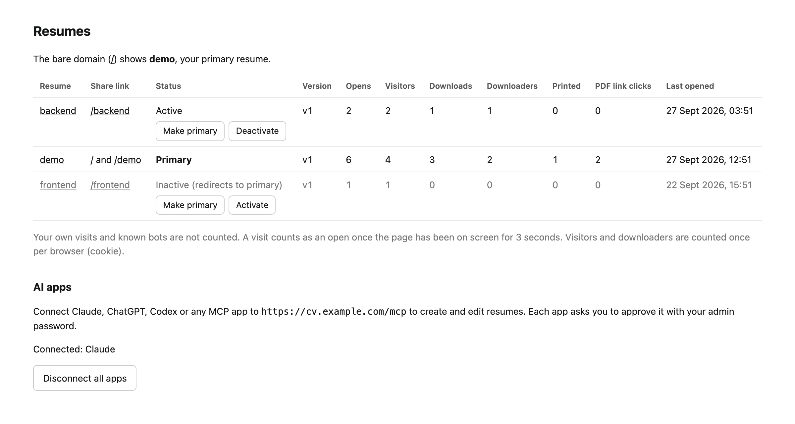
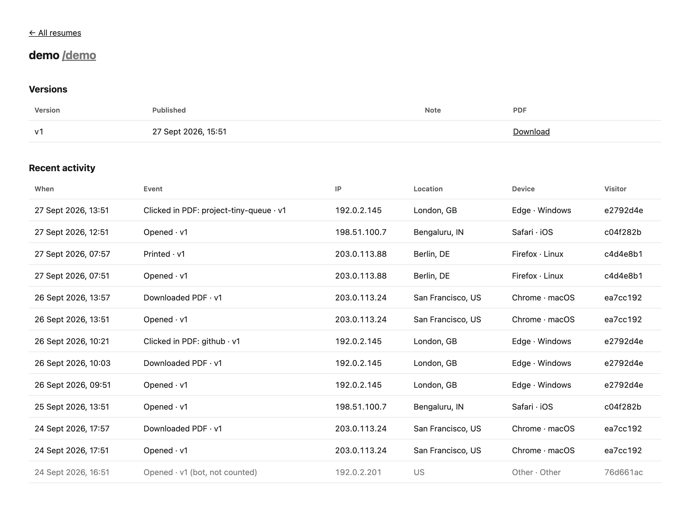

# Resume Platform

Share your resume as a link, see how often it's opened and downloaded, and edit it from any AI app.

**Live demo:** https://cv.amankrverma.in/demo (a fictional resume; try Download PDF)

- **One link per resume** (`yoursite.com/se`, `yoursite.com/pm`, …) that always shows the latest version, with a
  Download PDF button. Mark one resume **primary** to show it on your home page, and **deactivate** old ones (their
  links redirect to the primary).
- **Version history**: every publish is kept, with its PDF.
- **Stats**: opens, unique visitors, downloads, prints and clicks on links inside the PDF, with IP address,
  approximate location and device. Your own visits and bots aren't counted.
- **A real PDF**: rendered by headless Chrome from the same template as the page, with selectable text for applicant
  tracking systems and tracked links.
- **Edit from AI apps**: a built-in [MCP](https://modelcontextprotocol.io) server with OAuth, so Claude, ChatGPT, Codex
  and other MCP apps can create and edit resumes.

Built with Next.js, MongoDB, puppeteer-core with [@sparticuz/chromium](https://github.com/Sparticuz/chromium), and
[mcp-handler](https://github.com/vercel/mcp-handler).

The page people see when you share a link:



Your dashboard, with every resume, its status and its stats:



Who opened a resume, when, and from where (bots are marked and not counted):



The screenshots use a fictional resume and made-up visits.

## Run it locally

Needs Node.js 22.17+ (or 24), Google Chrome, and MongoDB.

```bash
git clone https://github.com/AmanKumarVerma11/resume-platform.git
cd resume-platform
npm install
cp .env.example .env.local   # then set ADMIN_PASSWORD and PUBLIC_BASE_URL=http://localhost:3000
docker run -d --name resume-platform-mongo -p 127.0.0.1:27017:27017 mongo:7
npm run publish-resume -- demo
npm run dev
```

Open http://localhost:3000/demo for the page and http://localhost:3000/admin for stats (sign in with
`ADMIN_PASSWORD`). MongoDB 8 images currently refuse to start on Docker Desktop's newer Linux kernel
(SERVER-121912), hence `mongo:7`.

## Your resume

A resume is JSON in a subset of the [JSON Resume](https://jsonresume.org) format: see `resumes/demo.json` and
`lib/resume-schema.ts`. Dates are `YYYY` or `YYYY-MM`, and `basics.summary` and `work[].highlights` accept `**bold**`.

Either publish it from a file (your own `resumes/*.json` files are git-ignored):

```bash
npm run publish-resume -- me --note "what changed"
```

or connect an AI app (below) and ask it to create or edit the resume. The file name, or the name you give the app,
is the link: `me` is shared as `yoursite.com/me`.

The publish command renders the PDF with your installed Chrome, skips publishing if nothing changed (`--force`
re-renders anyway), warns if the resume no longer fits on one page, and reads settings from `.env.local` (or
`--env <file>`, for example `.env.prod.local` to publish to production). If an AI app edited the resume last, it
won't overwrite that with an older file unless you add `--overwrite`.

## Deploy (Vercel and MongoDB Atlas)

1. Create a MongoDB Atlas cluster, near your Vercel functions' region. Under Network Access allow `0.0.0.0/0`,
   because Vercel functions have no fixed IPs.
2. Import your fork in Vercel and set these environment variables:
   - `MONGODB_URI`
   - `MONGODB_DB=resume`
   - `ADMIN_PASSWORD`: a long random password
   - `PUBLIC_BASE_URL`: your site's address, for example `https://cv.example.com`
3. Add your domain in the project's Settings → Domains.
4. Publish your first resume, either with the publish command and `--env` pointing at your production settings, or
   through an AI app, and make it primary in `/admin`.
5. Sign in to `/admin` once on each device you use, so your own visits aren't counted.

## Edit from AI apps (MCP)

The MCP endpoint is `https://your-site/mcp`. The first time an app connects, it opens a page on your site where you
approve it with your admin password. `/admin` lists connected apps and can disconnect them all.

- **Claude** (web, desktop, mobile): add a custom connector with that address.
- **Claude Code:** `claude mcp add --transport http resume https://your-site/mcp`, then `/mcp` to sign in.
- **Codex:** `codex mcp add resume --url https://your-site/mcp`, then `codex mcp login resume`.
- **ChatGPT:** turn on Developer mode (Settings → Security and login), then add the server as an app.

Tools: `list_resumes`, `get_resume`, `list_versions`, `save_resume`, `set_primary`, `set_active` and `get_stats`.
Saving renders the PDF on the server and the page updates immediately.

## How stats are counted

- **Opens**: the page was on screen for 3 seconds, which filters out link previews and email scanners.
- **Visitors and downloaders**: unique browsers, via a first-party cookie, so one person downloading twice counts once.
- **Printed**: someone used the browser's print or Save as PDF.
- **PDF link clicks**: links inside the PDF go through `/go/...`, so clicks from a downloaded PDF are counted.
- City and country come from Vercel's location headers, so they're only filled in on Vercel.

## Privacy

The site stores visitors' IP addresses, browser details and a cookie. If you run it, you are responsible for that
data. The site shows a cookie notice and includes Privacy, Terms and Cookie pages that fill in your name and email
from your primary resume. They're generic templates, not legal advice.

## License

Copyright (C) 2026 Aman Kumar Verma. Licensed under [AGPL-3.0](LICENSE). You can use, change and self-host this
freely. If you run a modified version as a service for
other people, you must make your source code available to them.

The bundled TeX Gyre Heros Condensed fonts have their own license: see [public/fonts/NOTICE](public/fonts/NOTICE).
